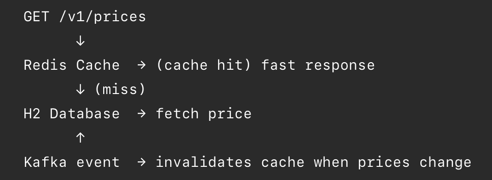
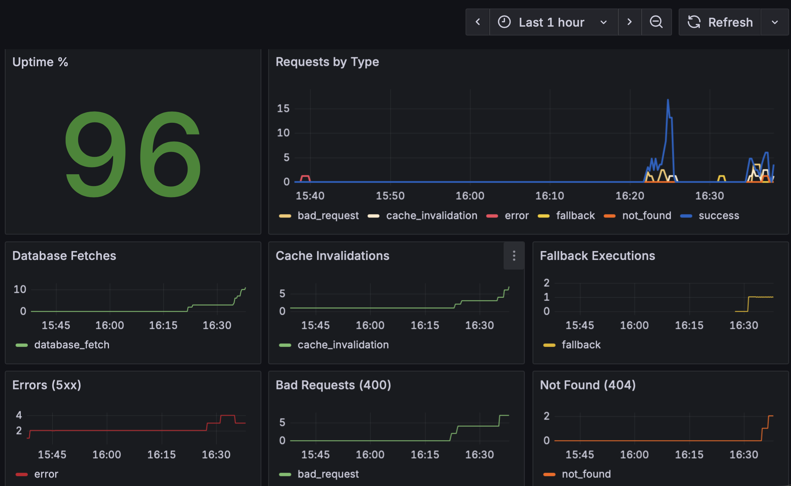
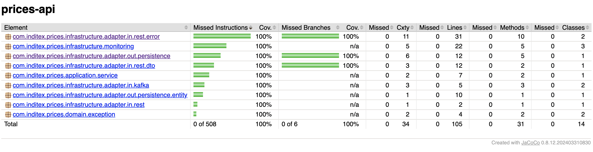

# Prices Api Service

### Overview
Service to retrieve final product prices using priority logic for overlapping date ranges.
The API resolves which price applies for a given date, product, and brand, respecting the business rules from the pricing table.
The service follows a hexagonal architecture and includes a Kafka-driven cache invalidation flow with Redis, simulating a realistic high-traffic ecommerce environment similar to Inditex systems.

### Key Features
- Hexagonal Architecture: Separation between business logic and infrastructure adapters (Kafka, Redis, SQL).
- Priority Logic: Rate selection based on the priority field when date ranges overlap.
- Real-time Cache Invalidation: Kafka consumer triggers Redis eviction upon price update events to ensure consistency.
- Resilience: Implementation of Circuit Breaker and Fallbacks using Resilience4j.
- Observability: Custom Micrometer metrics and Grafana dashboards included.

### How to run Local
The project uses different profiles for execution and integration testing
- **From console**: ```mvn spring-boot:run -Dspring-boot.run.profiles=local```.
- **From IntelliJ (or any IDE)** set profile **local** Note: In this profile, Kafka and Redis run in-memory. To test the real distributed flow with Postman, you must use the Docker Compose setup.

### How to run Integration Tests
Requires the integration profile to run embedded Kafka and H2 instances.
- **From console**: ```mvn clean test -Dspring.profiles.active=integration```.
- **From IntelliJ (or any IDE)** set profile **integration**

### How to run in "Prod" Mode
This mode starts the full stack:
- prices-api
- Kafka + Zookeeper
- Redis
- Prometheus
- Grafana
1) Build the application JAR: ```mvn clean package -DskipTests```
2) Start the stack (App + Kafka + Redis + Prometheus + Grafana) with: ```docker-compose up --build```

### Database
Uses H2 in-memory initialized via schema.sql and data.sql.

### API Documentation
Swagger UI available at: http://localhost:8080/swagger-ui/index.html

### Postman Collection
A Postman collection is included to simplify local testing:
[Price Collection.postman_collection.json](postman/Price%20Collection.postman_collection.json)

### Messaging & Cache flow (Kafka + Redis)
To simulate a production-grade ecommerce system:

- Kafka is used as an event bus for price updates.
- A Kafka consumer invalidates Redis entries when a price change is published.
- This keeps cache consistent without coupling services synchronously.

### Resilience & Observability
- Circuit Breaker (Resilience4j) protects database access.
- Fallback handling returns controlled 503 responses when needed.
- Micrometer metrics track:
  - success
  - not found
  - bad request
  - database fetch
  - cache invalidation
  - fallback executions

### Error handling
The API standardizes responses via a global exception handler:
- 400 → invalid parameters or wrong date format
- 404 → price not found for given criteria
- 503 → service unavailable (circuit breaker open)
- 500 → unexpected internal error

### Monitoring with Grafana
Grafana is exposed on port 3080 (to avoid conflicts if you already have Grafana running).
- Dashboard URL: http://localhost:3080/d/price-detail-metrics-v1


### Test Coverage
Current coverage results:Coverage

